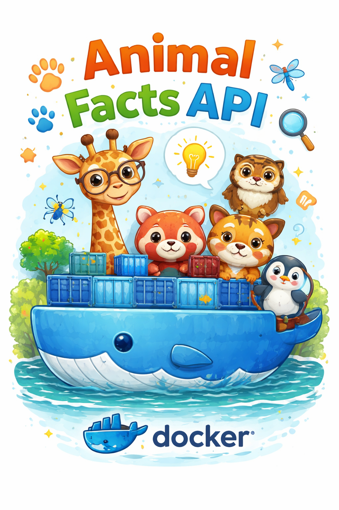

<p align="center">
  
</p>

# Animal Facts API

API gratuita de animales aleatorios con FastAPI, SQLite y base de datos pública incluida en el propio proyecto.

Está pensada para educación, portfolios, demos, productos visuales, experimentos de frontend y cualquier app que necesite un animal aleatorio con descripción, curiosidades e imagen en base64 sin depender de servicios de pago.

## Qué hace bien este proyecto

- Devuelve un animal aleatorio listo para mostrar en pantalla.
- Incluye una base SQLite pública dentro del repo.
- No necesita API keys.
- No descarga datos externos al arrancar.
- Expone imágenes en `img_b64`, muy cómodas para frontend.
- Se puede ejecutar en local con Python, Docker o entornos tipo Unraid.
- Tiene un backend pequeño, claro y fácil de mantener.

## Endpoint principal

```text
GET /animal-aleatorio
```

Respuesta típica:

```json
{
  "id": 1633,
  "nombre": "Picamaderos",
  "url": "https://es.wikipedia.org/wiki/...",
  "url_imagen": "https://upload.wikimedia.org/...",
  "descripcion": "Descripción breve del animal.",
  "img_b64": "/9j/4AAQSkZJRgABAQ...",
  "curiosidades": "Texto breve con enfoque divulgativo."
}
```

Endpoint de salud:

```text
GET /health
```

Documentación interactiva:

```text
GET /docs
```

## Base de datos pública incluida

La base publicada del proyecto está aquí:

```text
api/animales.db.zip
```

Eso permite que cualquier persona pueda clonar el repo y levantar la API sin descargar nada adicional.

Datos actuales de la base:
- 2239 animales.
- 2239 filas con `id`.
- 2239 filas con `nombre`.
- 2239 filas con `url`.
- 2239 filas con `descripcion`.
- 2169 filas con `img_b64` valida.
- 2239 filas con `curiosidades`.
- 2174 filas con `url_imagen`.

Punto importante:
- la API excluye 70 filas antiguas con `img_b64` corrupta.
- `url_imagen` es opcional.
- `img_b64` valida sigue siendo la opción más fiable para frontend.

## Fuente de datos y reutilización responsable

El dataset base se apoya en Wikipedia y Wikimedia Commons.

En concreto:
- `nombre`, `url` y `descripcion` se apoyan en información de Wikipedia.
- `url_imagen` apunta a recursos de Wikimedia Commons.
- `img_b64` se genera a partir de esas imágenes.
- `curiosidades` se presenta como capa divulgativa dentro del producto final.

Sobre licencias y uso:
- el código del proyecto se comparte con finalidad educativa y práctica.
- la base incluida es pública dentro del repo.
- este proyecto no reemplaza la licencia original de cada texto o imagen de terceros.
- si reutilizas contenido concreto, debes revisar la licencia y la atribución de la fuente original.

## Docker y Unraid

Sí, puedes usar la imagen del proyecto para que se vea mejor en Unraid.

Lo habitual en Unraid es configurar el icono desde la plantilla del contenedor o desde una URL pública de icono. Por eso este repo incluye `logo.png` en la raíz y puedes usar esta URL pública:

```text
https://raw.githubusercontent.com/webcvalejandropina-ui/animales-api/main/logo.png
```

Configuración útil para Unraid:
- nombre recomendado del contenedor: `animales-api`
- puerto por defecto: `13008`
- icono recomendado: la URL `raw` del logo

Si usas una plantilla manual, el icono suele pegarse en el campo `Icon URL`.

## Ejecución rápida

### Python local

```bash
cd api
python3 -m venv .venv
source .venv/bin/activate
pip install -r requirements.txt
uvicorn app.main:app --host 127.0.0.1 --port 13008
```

### Docker

```bash
cd api
docker compose up --build
```

Puerto por defecto:

```text
13008
```

URLs locales:

```text
http://127.0.0.1:13008/health
http://127.0.0.1:13008/animal-aleatorio
http://127.0.0.1:13008/docs
```

### Imagen local en `.tar`

Si quieres generar una imagen local exportable, el proyecto incluye este script:

```bash
cd api
./export-image-tar.sh
```

Eso crea este archivo:

```text
api/animales-api.tar
```

Punto importante:
- el arranque normal recomendado sigue siendo solo con Docker Compose.
- para levantar el proyecto desde código fuente basta con `docker compose up --build`.
- el `.tar` es un artefacto opcional para mover la imagen a otra máquina o guardarla offline.

Si más adelante quieres cargar ese `.tar` en otra máquina:

```bash
docker load -i animales-api.tar
cd api
docker compose up -d
```

## Archivos clave

```text
logo.png
README.md
api/Dockerfile
api/animales.db.zip
api/docker-compose.yml
api/export-image-tar.sh
api/requirements.txt
api/app/__init__.py
api/app/database.py
api/app/main.py
```

## Qué valida la app al arrancar

La aplicación:
- expande `api/animales.db.zip` a `api/animales.db` si hace falta.
- abre la SQLite en modo solo lectura.
- valida que la tabla exista.
- valida que la base no esté vacía.
- carga solo animales públicos con `id`, `nombre`, `url`, `descripcion`, `curiosidades` e `img_b64` realmente válida.

Si alguna de esas comprobaciones falla, la API no arranca.

## Uso rápido de `img_b64`

HTML:

```html

```

JavaScript:

```js
const imageSrc = buildImageSrc(animal.img_b64)
```

## Resumen

Animal Facts API es un proyecto pequeño, bonito, gratuito y muy fácil de reutilizar.

Si quieres una API de animales lista para enseñar, desplegar y conectar a cualquier frontend, aquí tienes una base muy sólida para empezar rápido.
